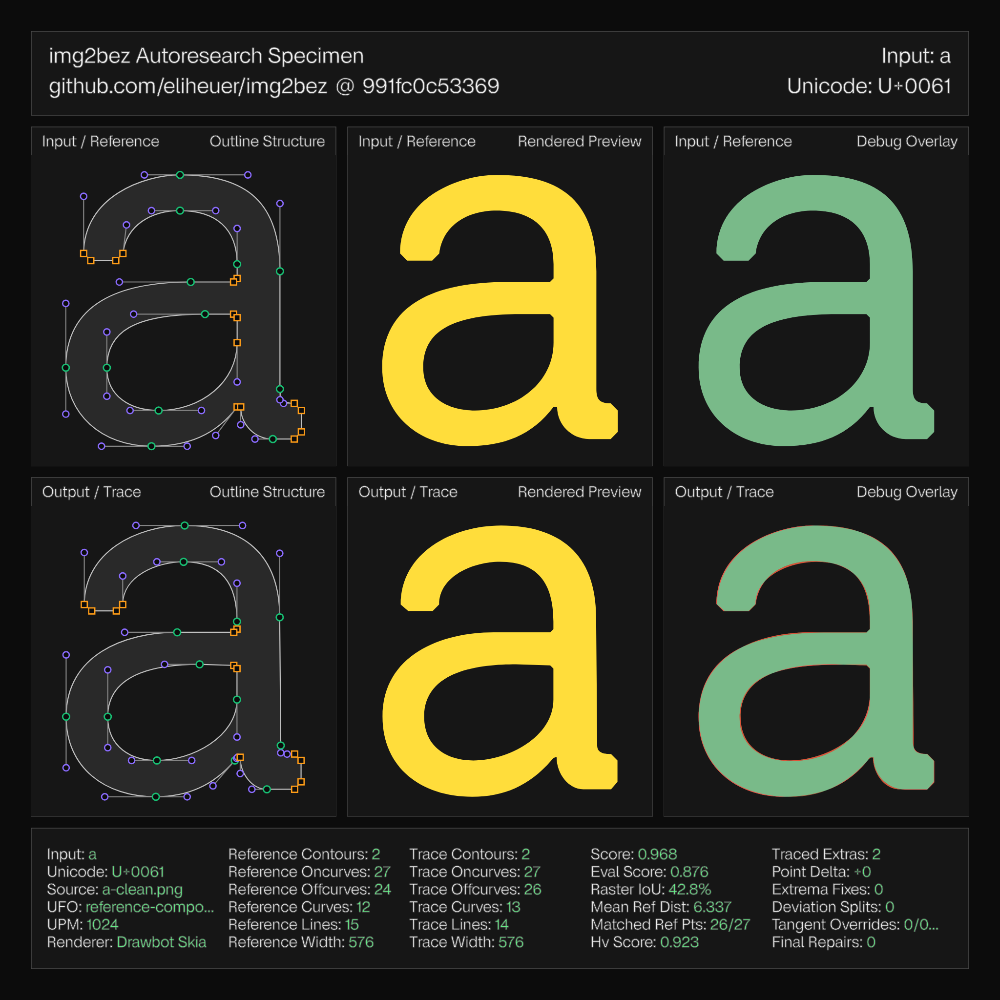

img2bez is a free and open-source Rust library and CLI tool that traces bitmap glyph images into cubic bezier outlines and writes them directly into [UFO](https://unifiedfontobject.org/) font sources. It is built on the [Linebender](https://linebender.org) ecosystem—[kurbo](https://crates.io/crates/kurbo) for curve math and [norad](https://crates.io/crates/norad) for UFO handling—and the source is at [github.com/eliheuer/img2bez](https://github.com/eliheuer/img2bez).

Published June 10th, 2026

### The problem

Raster-to-vector tracing is an old problem with a good classical solution, so a new tracer needs a justification. Mine is that the classical solution—and, interestingly, the newer differentiable one—optimizes the wrong objective for type design.

I work on font tooling: [Bezy](https://bezy.org), a font editor, and pipelines where AI agents participate in drawing type. In those pipelines letterforms keep showing up as raster images—scans of lettering, renders from image models, screenshots of old specimens. Image models in particular have gotten good at drawing letterforms, but they output pixels, and the gap between "a picture of the letter" and "a font source you can edit, interpolate, and compile" is tracing.

The catch is that font sources are judged by their *structure*, not just their silhouette. Type design has strong drawing conventions (Ohno Type's ["Drawing Vectors"](https://ohnotype.co/blog/drawing-vectors) is a good summary), and they exist for mechanical reasons—editing cost, interpolation compatibility, rendering quality:

- **Minimum points.** Every extra on-curve point is something a designer manages on every edit, in every master of a variable font.
- **Points at extrema**, with handles leaving exactly horizontally or vertically.
- **Lines are lines**, not flat curves with vestigial handles.
- **Points at inflections**, where a curve changes directional bias—the spine of an `s`.
- **Deliberate junction detail.** In the typeface I evaluate against, every stroke junction—the crotch of a `v`, the saddles between `m`'s arches, all four crossings of an `x`—is drawn with a tiny axis-aligned flat, eight units wide. That's a design decision, repeated everywhere, and a trace that misses it is structurally wrong even when it is geometrically close.

An outline can match the bitmap to a tenth of a pixel and fail all of these. A trace with forty points where a designer used twenty, diagonal handles at the extrema, and curves where lines should be is not a head start on a font; cleaning it up usually takes longer than redrawing. So the design goal of img2bez is: **the output should look like a perfect trace that a type designer then drew over, with structure taking priority wherever the two conflict.**

### Prior art, and why it solves a different problem

**Potrace.** Peter Selinger's [Potrace](https://potrace.sourceforge.net/potrace.pdf) (2003) is the gold standard of classical tracing—it's inside Inkscape and FontForge, and the paper is a model of clarity. The pipeline: threshold to binary, decompose the pixel boundary into paths, find an optimal polygon approximation by dynamic programming, classify each polygon vertex as corner or smooth using a parameter called *alpha*, then fit curves. img2bez contains a Rust reimplementation of this pipeline and still routes 1-bit and aliased sources through it, because Potrace's staircase handling is genuinely good for that input class.

For anti-aliased renders of type, though, Potrace has two structural mismatches. The first is thresholding itself: anti-aliasing carries roughly a tenth of a pixel of boundary position information, and binarization quantizes that to half a pixel. Every downstream decision—straight versus curved, corner versus smooth, where exactly the extremum sits—then has to be made through heuristics tolerant of ±0.5px of noise, and those heuristics get fragile precisely where type cares most: flat extrema, shallow joins, overshoot regions.

The second is what alpha actually measures. It classifies a vertex by how far it deviates from its neighbors' chord, which conflates *deviation* with *sharpness*: on a large smooth arc, polygon facets are long, so mid-arc vertices deviate a lot from their chords even though the turning is shallow. The practical result is false corners at the flattest part of an `o`—exactly where a designer wants a single smooth extremum with horizontal handles. And even where Potrace traces cleanly, nothing in its objective asks for extrema, H/V handles, or junction conventions, so it doesn't produce them except by accident.

**The curve-fitting literature.** Philip Schneider's Graphics Gems fitter and its descendants solve least-squares cubic fits with tangent constraints; Raph Levien's [fitting work](https://raphlinus.github.io/curves/2021/03/11/bezier-fitting.html) in kurbo goes further, solving for the cubic that matches the source curve's signed area and first moment, which reduces the search to a quartic whose roots enumerate all candidate minima—no local-minimum traps—plus globally optimal subdivision in the `_opt` variant. This is essentially a solved sub-problem and img2bez leans on it directly (`fit_to_bezpath_opt` is the fallback fitter). But fitting is the *last* step. The hard part of tracing type is everything upstream: deciding where the structural points go and what kind of point each one is. No fitter answers that.

**Differentiable rasterization.** The research frontier went a different way: [diffvg](https://people.csail.mit.edu/tzumao/diffvg/) backpropagates an image-space loss through the rasterizer into curve control points, and a family of learned vectorization models builds on that. I find this line of work genuinely useful—img2bez borrows its central approximation, more below—but a gradient optimizes *geometry under a fixed structure*. It can slide a control point; it cannot decide that a designer would have drawn one tense cubic instead of two timid ones, or that this particular valley should be a tiny flat with two new points. Structure decisions are discrete. The learned systems also need training data and GPUs, and the outlines they produce have the same structural problems as everything else.

### How img2bez works

The pipeline is a sequence of stages, each of which makes one kind of decision a designer makes implicitly. (Full detail with thresholds and rationale is in [docs/autotracing-research.md](https://github.com/eliheuer/img2bez/blob/main/docs/autotracing-research.md).)

**1. Sub-pixel boundary extraction.** Marching squares over the *grayscale* image at the threshold iso-level, with linear interpolation along grid edges. This is the move that fixes Potrace's first problem: rather than discarding the anti-aliasing, the boundary is recovered *from* it. On a synthetic anti-aliased disk the extracted contour is accurate to under 0.35px. One detail that mattered in practice: crossing chaining is made fully deterministic by sorting edge keys, because a contour's start point must not depend on hash order—sub-pixel shifts flip marginal classifications downstream.

**2. Adaptive smoothing.** The boundary is resampled at 1px arc-length spacing and smoothed with a small Gaussian (σ = 1.2 samples). If the result still doesn't read as clean type geometry—mean absolute turn above 0.10 radians per sample, or corners detected more often than once per 30 samples, which real glyphs never do—σ escalates by 1.8× and tries again, up to four times. Clean renders never escalate; degraded sources get progressively stronger treatment at their own noise scale.

**3. Structure detection from curvature.** Every structural point comes from the turn-angle signal of the smoothed boundary:

- A **corner** is *concentrated* turn: at least 12° inside a ±1-sample window that also accounts for at least 55% of the turn in the surrounding ±5-sample window. This is the fix for Potrace's alpha problem—an impulse test rather than a deviation test, so a sharp 20° serif join (impulse) separates cleanly from a tight smooth arc (distributed turn).
- A **straight run** is a maximal stretch whose chord deviation stays under `max(0.15px, 0.005 × chord)`. The envelope is linear in chord length on purpose: a true line's deviation is flat noise while an arc's grows quadratically with chord, so a linear envelope separates them at every scale.
- **Extrema** come from derivative sign changes with ~1px prominence, localized by fitting a parabola to the coordinate signal—which lands them within a pixel of where the designer put the point.
- **Inflections** are persistent sign changes of smoothed curvature.

The output of this stage is, by construction, the point set a designer would place.

**4. Constrained fitting.** Each curved section gets a least-squares cubic whose end tangent *directions* are fixed—exactly horizontal or vertical at extrema, the adjacent line's direction at tangent points—so only the two handle lengths are free. Handles come out exactly H/V because nothing else is representable, not because of post-hoc snapping. Fixing directions also makes the fit robust to a split point sitting a couple of pixels off the true extremum. Sections that miss tolerance split once at their dominant curvature-sign change (a designer's inflection point); only if that also fails does kurbo subdivide freely.

**5. Continuity passes.** Corners that rasterization rounded into tiny curves between straight edges are rebuilt as sharp intersections. Smooth joins get G1 alignment, then the G2 "harmonization" rule used by the Glyphs and FontLab editors: intersect the two handle lines at `d`, form `p = sqrt(p0·p1)` from the handle-length ratios on each side, and move the on-curve point to `t = p/(p+1)` along the segment between the inner handles, equalizing curvature across the join.

**6. Raster-loss refinement.** This is where the diffvg idea pays off, in a form cheap enough to run in a CLI tool. The prefilter approximation says that near the outline, a pixel's ink coverage is a linear ramp in its signed distance `s` to the path: `coverage ≈ clamp(0.5 + s, 0, 1)` with `s` in pixels, signed toward the ink. So the mean squared coverage error over a 2px band of pixel centers is a smooth, honest score for *any candidate outline*—including candidates with different structure than the current one. And because stages 1–5 already produce a sub-pixel-accurate outline, there's no need for autodiff or gradient descent: the few remaining degrees of freedom per decision can be solved by golden-section search.

One amusing wrinkle: optimizing a cubic's two handle lengths (α, β) independently stalls on arcs, because the loss forms a narrow diagonal valley along α + β ≈ constant—many cubics trade tension between their handles almost freely. Searching the mean and difference directions first fixes it. This is the kind of thing the differentiable-rasterization papers handle with momentum; with two variables you can just look at the valley and aim along it.

The refinement runs three structural judgments, each phrased as *candidates competing on the band loss*:

- **Junction flats.** At each sharp valley whose depth axis is near-horizontal or near-vertical, three structures compete: the outline as fitted, a sharp vertex pushed along the wedge bisector to its loss-minimizing depth, and a tiny axis-aligned flat whose depth (and width, for bare vertices) is optimized. The flat is applied only when it beats *both* rivals by a clear margin. The sharp competitor is what makes this safe: a genuinely sharp corner ties with it, so the flat can never win there—it only wins where the ink really is flat-bottomed. This single mechanism recovered the junction convention across the whole alphabet.
- **Merges.** Adjacent same-turning cubics whose shared joint was created by fit subdivision (not by a real feature) are replaced by one re-optimized cubic when it reproduces the raster nearly as well—the long tense cubic a designer draws on a bowed diagonal, instead of two timid ones. The fair baseline matters: the pair gets re-optimized too before the comparison, otherwise every merge looks good simply because one side was optimized and the other wasn't.
- **Polish.** Remaining handle lengths are re-fit against the image, but only inside a dead band: the current fit must be clearly poor, the improvement large, and the result genuinely good. Marginal gains aren't worth perturbing handles the contour fit already placed well.

Structure is otherwise protected by construction—handle directions never change, on-curve points never move—and the refinement runs before the final G2 pass, so the type-design conventions keep the last word.

A war story from this stage, because it changed my mind about where the difficulty lives. While tuning the junction judge, every V-shaped candidate scored absurdly badly—band losses around 0.4 when well-fitted geometry scores 0.01. The cause was the signed-distance function: for a pixel in the *outer cone* of a sharp vertex, the nearest feature is the vertex itself, and taking the sign from whichever adjacent segment happens to win the nearest-window race misclassifies roughly half of those pixels. The fix is the classic one—sign against the angle-bisecting pseudo-normal at vertices—plus a second fix on top, because concatenated polylines repeat their joint points and a duplicated vertex silently degenerates the pseudo-normal to one side. Fixing this one function improved the trace of seven glyphs. The lesson: when your optimizer's judgments look insane, audit the loss before the candidates.

### Measuring "draws like a designer"

The part of this project I would defend hardest is not the tracer, it's the evaluation. "Draws like a designer" sounds unfalsifiable; the harness makes it a number.

img2bez is developed against a reference UFO—[Virtua Grotesk](/fonts/virtua-grotesk), a typeface I drew—in a loop that renders each hand-drawn glyph to a bitmap, traces it back, and compares the result against the original outlines *structurally*: point counts and placement, line/curve mix, H/V handle ratio, how many reference points the trace matched within tolerance. A specimen sheet (the images in this post) puts reference and trace side by side with full point structure and a technical readout, and a stress gate fails the build if any glyph's structure drifts past bounds.

Across basic Latin (a–z, A–Z, 0–9) the mean structural score is currently **0.967**, with 14 glyphs reproducing their reference outlines exactly and all 62 passing the gate. Per-glyph numbers are in [docs/quality.md](https://github.com/eliheuer/img2bez/blob/main/docs/quality.md).

The harness is also what makes agentic development work. Most of img2bez's recent progress came from autoresearch loops: an agent proposes a mechanism, the harness scores all 62 glyphs against the references, regressions are rejected outright, and the specimen sheets make failures legible at a glance. The junction-flat mechanism went through roughly a dozen propose–measure–reject iterations in an afternoon, including two proposals that scored well for bad reasons and got caught by the per-glyph diff. I don't think the tracer's current quality would have been reachable by judgment alone; I'd have shipped at least two of the bad versions.

### Limitations, and an invitation

What doesn't work yet, honestly stated. Two glyphs (`7`, `y`) draw a short straight segment where the trace runs the adjacent curve through—a line/curve boundary placement problem that the same candidates-compete-on-the-raster machinery should be able to judge, but doesn't yet. Low-resolution and heavily degraded sources still over-segment. The G2 harmonization is pairwise at joins; a global curvature-energy polish would do better on long multi-segment curves. And everything is tuned against one reference design—the conventions it encodes (the 8-unit junction flats, for instance) are *that typeface's* conventions, and more reference UFOs are needed to learn which parts generalize.

If you work on font tooling, curve fitting, or tracing, I would genuinely like your feedback—on the approach, the code, or the parts I've gotten wrong. The repo is [github.com/eliheuer/img2bez](https://github.com/eliheuer/img2bez), issues and PRs are welcome, and I'm around the [Linebender Zulip](https://xi.zulipchat.com).
